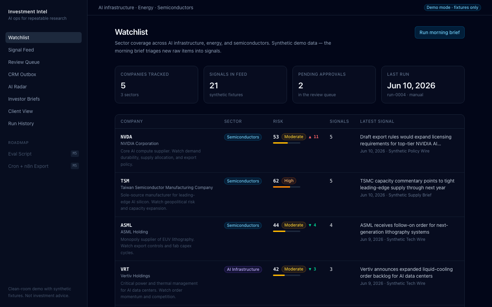
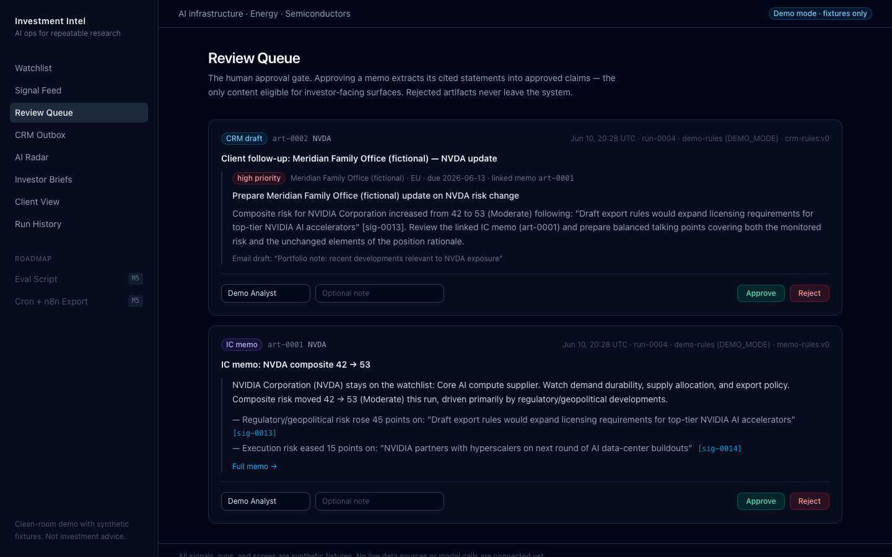
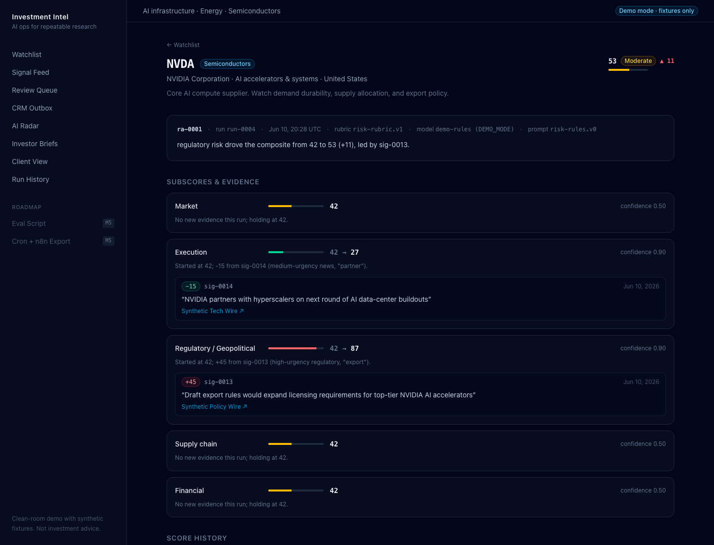
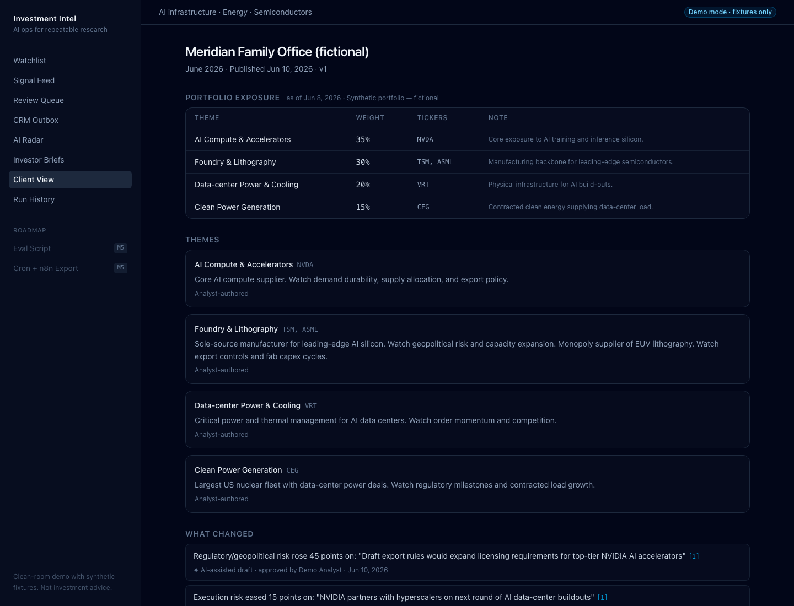
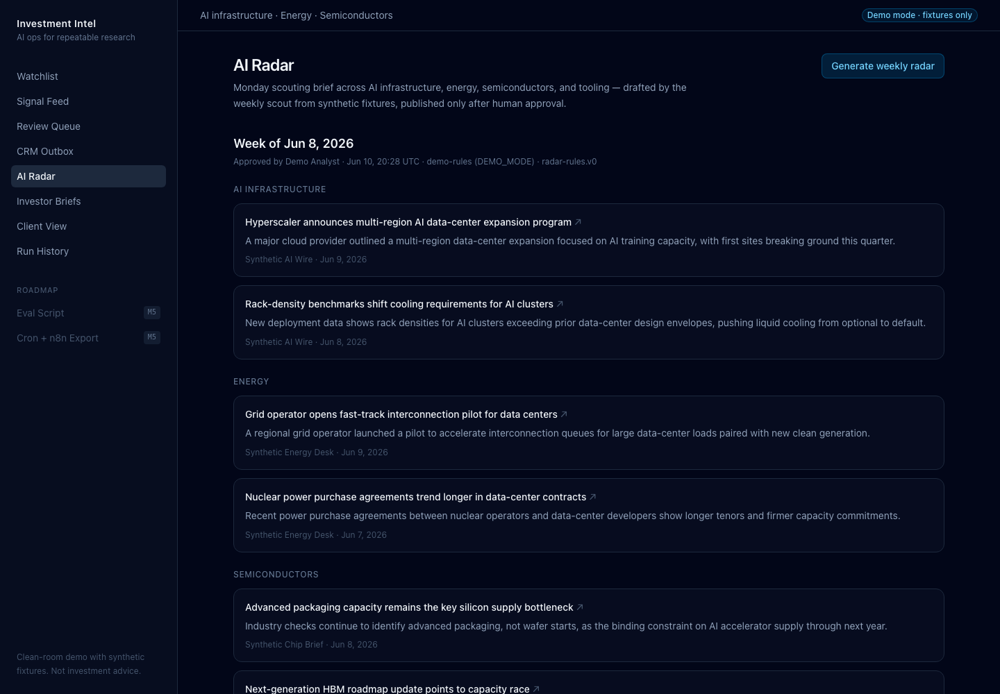
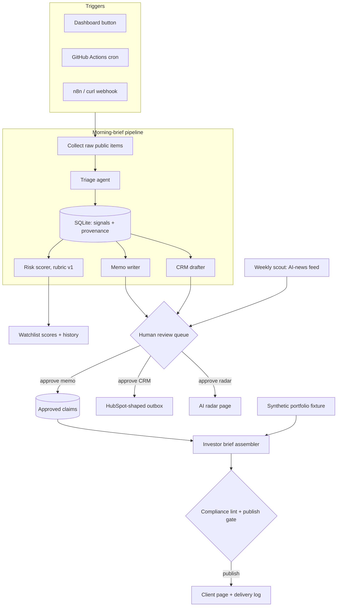

# Investment Intel Dashboard

A multi-agent research pipeline for a sector watchlist: public signals in, governed and source-linked investor communication out, with a human approval gate in between.

[](https://github.com/Linh86/investment-intel-dashboard/actions/workflows/ci.yml) [](LICENSE) 

<!-- DEMO_RECORDING: replace the line below with the link to the 2-minute walkthrough -->
🎥 2-minute demo recording — link coming.

## The most interesting agent I've built

Investment teams repeat the same loop every morning — scan the watchlist for what changed, decide what matters, update risk views, write it up, prep client follow-ups — and the reasoning behind each number usually lives in someone's head or a chat transcript. This project runs that loop unattended: it collects public-source items, triages them into typed signals, rescores companies against a versioned rubric with evidence-backed subscores, and drafts an IC memo plus a CRM follow-up whenever a composite moves 10+ points. The interesting part is the governance: nothing reaches the CRM outbox or a client page without a named human approving it, every claim traces back through signals to source URLs and content hashes, and investor briefs are assembled exclusively from approved claims and must pass a deterministic compliance lint before publishing. A morning's repeated research loop becomes one button or one cron line. In demo mode a run costs $0.00 — deterministic rule-based agents behind the same zod schemas a live LLM implementation would have to satisfy — and with live models it would cost pennies. Months later, every number on the dashboard is still defensible, because the run that produced it recorded its model, prompt version, sources, and approver.

## Why this beats typing into a chatbot

Chat answers questions; this runs a process.

| This system | A chat session | Why it matters |
| --- | --- | --- |
| Scheduled watchlist runs (button, cron, webhook) | You remember to ask every morning | Nothing slips through |
| Schema-validated 0–100 risk scores | Prose you re-read | Sortable, trendable, alertable |
| Provenance per claim (claim → signals → source URL + hash) | Trust the transcript | Every number auditable months later |
| Versioned prompts + rubric, measured by an eval harness | Silent prompt drift | Changes are measured, not vibes |
| Approval gate with named reviewer and note | Copy-paste risk | Nothing outbound goes unreviewed |
| CRM-shaped output with a governance block | Manual reformatting | Lands where the team already works |
| Client briefs built from approved claims only | Raw model text pasted to a client | Compliance-linted, tamper-evident publishing |

## Ninety-second tour

**1. Run.** One click triages 10 raw public-source items into 9 typed signals; NVDA's composite moves 42 → 53 on a planted export-control item.



**2. Review.** The score move drafted an IC memo and a CRM follow-up; a named human approves or rejects each, and approving the memo extracts its cited statements into approved claims.



**3. Trace.** Every subscore and claim links back through signals to source URLs and content hashes — the +11 is explainable end to end.



**4. Publish.** An investor brief assembled only from approved claims passes the compliance lint and publish gate, then renders on a client page with zero internal metadata.



**5. Repeat weekly.** The scout drafts a Monday AI radar behind the same review gate.



## Architecture



Workflows for the predictable, agents for the ambiguous: fetching, dedup (raw-item hashes), score combination, linting, and publishing are plain deterministic code; the judgment steps — triage, evidence-backed scoring, drafting — sit behind zod schemas. In DEMO_MODE (the default) those judgment steps are rule-based implementations, so everything runs offline with no API keys; live LLM implementations slot in behind the same schemas, with model routing planned: a small model for triage volume, a large one for memo-grade judgment.

## Quickstart

Requires Node.js 20+. Everything runs offline — no API keys, no network calls.

```bash
npm install
npm run db:reset
npm run dev
```

The full arc at http://localhost:3000: click **Run morning brief** → approve the memo (and CRM draft) in **/review** → draft and publish a brief in **/briefs** → view it as a client at **/client/seg-eu-family** → generate the weekly radar from **/radar**. `npm run db:reset` restores pristine demo state at any time, even while the dev server is running.

The same three actions over HTTP:

```bash
curl -X POST localhost:3000/api/runs/morning-brief -H 'content-type: application/json' -d '{"trigger":"webhook"}'
curl -X POST localhost:3000/api/runs/weekly-radar  -H 'content-type: application/json' -d '{"trigger":"webhook"}'
curl -X POST localhost:3000/api/briefs/generate    -H 'content-type: application/json' -d '{"segmentId":"seg-eu-family"}'
```

## The agents

Each agent is deterministic in DEMO_MODE, behind the exact zod schema a live LLM implementation would have to satisfy — swapping in a model changes the implementation, not the contract.

| Agent | Input → output | Gated? |
| --- | --- | --- |
| Source Collector | Fixture feed → raw items (title, snippet, URL, content hash) | No — internal ingestion |
| Triage | Raw item + watchlist → typed signal (ticker, type, urgency, confidence, rationale) | No — internal, feeds everything downstream |
| Risk Analyst | Company signals → five evidence-backed subscores; plain code combines them into a 0–100 composite | No — internal score, fully traceable |
| Memo Writer | Signals + score move → IC memo with inline signal citations | Yes — review queue |
| CRM Drafter | Score move → follow-up task + email draft for a fictional segment | Yes — review queue, then outbox |
| Weekly Scout | AI-news fixture → Monday radar draft | Yes — review queue |
| Brief Assembler | Approved claims + synthetic portfolio → investor transparency brief | Yes — compliance lint + publish gate |

## Governance and audit

- **Provenance chain.** Every published claim joins through `claim_signals` to its signals, and each signal to a raw item with source URL and content hash — claim → signals → sources, no orphans.
- **Versioned everything.** The rubric is `risk-rubric.v1` (five weighted dimensions, composite computed in plain code). Every run step records its model and prompt version (`triage-rules.v0`, `risk-rules.v0`, …) plus token counts and cost.
- **Approval records.** Every approve/reject stores reviewer, note, and timestamp. Rejected drafts never leave the system.
- **Compliance lint, five deterministic rule families:** `forbidden-phrases` (12 phrases including "will outperform", "guaranteed", "we recommend"; matching is whitespace- and hyphen-normalized and scans *all* client-visible text, including source names and disclosure copy), `required-disclosures` (jurisdiction-aware US/EU blocks), `balance` (reported changes must come with monitored risks), `claim-provenance` (every claim cites its sources), `theme-thesis` (every theme carries an analyst-authored thesis).
- **Tamper-evident publish.** The publish gate re-runs the lint and re-verifies every claim is still approved at publish time; published briefs are immutable snapshots, and a delivery log records who published what to which segment, when.
- **Clean client surface.** The client page renders no model names, prompt versions, or internal identifiers — verified adversarially during M4 review.

## Integrations

- **HTTP endpoints** — the three `POST` routes above (`/api/runs/morning-brief`, `/api/runs/weekly-radar`, `/api/briefs/generate`) accept any scheduler or webhook caller.
- **GitHub Actions CI** ([.github/workflows/ci.yml](.github/workflows/ci.yml)) — lint → build → `db:reset` → pipeline smoke test (asserts a cron-triggered run still produces exactly 9 signals and 5 risk assessments) → `npm run eval`. Entirely offline, zero secrets.
- **Scheduled morning brief** ([.github/workflows/morning-brief.yml](.github/workflows/morning-brief.yml)) — weekday 07:00 UTC cron plus manual dispatch; writes a run summary table (run id, signals, assessments, artifacts) to the job summary. Also zero secrets.
- **n8n export** ([integrations/n8n-weekly-radar.json](integrations/n8n-weekly-radar.json)) — importable workflow: Monday 07:00 schedule → POST weekly-radar → if a draft was created, Slack-notify that it awaits human review. Make/Zapier can hit the same two run endpoints; see [integrations/README.md](integrations/README.md).
- **HubSpot-shaped outbox** — approved CRM drafts land in `/outbox` as import-ready JSON with a full governance block (run, model, prompt version, approver).

## Evals

At this scale, a labeled eval set beats fine-tuning: 15 cases are enough to measure any implementation swap — rules → LLM, model A → B, prompt v1 → v2 — in seconds, while fine-tuning needs orders of magnitude more data and hides exactly the regressions an eval catches.

`npm run eval` runs the triage classifier ([scripts/eval-triage.ts](scripts/eval-triage.ts)) against [evals/triage-cases.json](evals/triage-cases.json) — 15 labeled synthetic cases including two-company headlines, common-noun alias traps, and urgency edge pairs. Current deterministic-triage accuracy:

| Field | Accuracy |
| --- | --- |
| Ticker | 13/15 (86.7%) |
| Signal type | 12/13 (92.3%) |
| Urgency | 11/13 (84.6%) |
| Exact match | 10/15 (66.7%) |

The five misses are honest keyword-rule ceilings — a multi-company headline attributed by iteration order, "Constellation" matched as a common noun, urgency rules that cannot tell a routine license renewal from a production-halt shock. Those are precisely the judgment calls the LLM triage upgrade behind the same schema is for, and this harness is what will prove that swap is actually an improvement.

## Clean-room statement

This repository is independent of any proprietary project: newly written code, synthetic fixtures, and fictional clients only. Client segments ("Meridian Family Office (fictional)", "Aldermoor Pension Partners (fictional)") and all portfolio exposure are invented; the only real-world references are public company tickers (NVDA, TSM, ASML, VRT, CEG). Sources are public metadata only — titles, snippets, URLs, hashes — never full article bodies. No proprietary code, private data, internal prompts, customer data, secrets, or screenshots of private systems are included. Full policy: [docs/security-clean-room.md](docs/security-clean-room.md). This is a demo of process automation and governance, not investment advice.

## Status & roadmap

- **M0** ✅ (2026-06-10) — scaffold, dashboard shell, seeded watchlist; app boots offline.
- **M1** ✅ (2026-06-10) — SQLite/Drizzle/zod, raw-item ingestion, deterministic triage, `POST /api/runs/morning-brief`, real run history.
- **M2** ✅ (2026-06-10) — risk scorer with score history, planted export-control event, provenance panel.
- **M3** ✅ (2026-06-10) — memo writer, review queue, CRM outbox, claim extraction on approval.
- **M4** ✅ (2026-06-10) — weekly radar; investor briefs from approved claims only, compliance lint, client page, delivery log (adversarially verified).
- **M5** ✅ (2026-06-10) — this README, CI + scheduled morning brief, n8n export, eval harness, screenshots.

Deliberately out of scope — the boundary is drawn, not forgotten: live LLM mode behind the provider interface (today `DEMO_MODE=false` is explicitly rejected rather than half-implemented), live RSS/EDGAR ingestion, real HubSpot push, an authenticated client portal, and score backtesting. None is needed to evaluate the workflow, the governance, or the agents. Full plan: [docs/mvp-plan.md](docs/mvp-plan.md).

License: [MIT](LICENSE).
