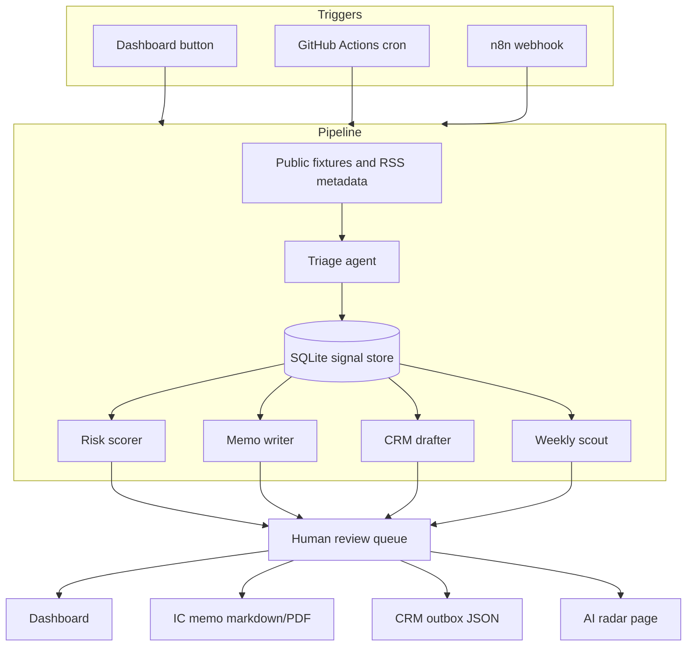

# MVP Plan

## Goal

Build a small but impressive interview demo for an investment firm that wants AI agents, workflow automation, weekly AI scouting, CRM integration, and analytical reporting.

The demo should prove practical implementation ability, not theoretical AI research.

## Product Sentence

An always-on junior analyst for a sector fund: it watches a public-company watchlist, turns public news into structured signals, updates risk scores with provenance, drafts IC memos and CRM follow-ups behind a human approval gate, and ships a Monday AI radar brief.

## Required Capabilities

- Agent workflow orchestration.
- Public source ingestion.
- Risk scoring.
- Investment memo generation.
- CRM-ready output.
- Weekly AI scouting.
- Audit trail and source provenance.
- Human approval gate.

## Architecture

## Milestones

| Milestone | Scope | Verification |
| --- | --- | --- |
| M0 | Scaffold repo, dashboard shell, seed watchlist | App boots and shows companies |
| M1 | Fixture ingestion and triage agent | Signals stored with source metadata |
| M2 | Risk scorer and score history | Planted event changes a score |
| M3 | Memo writer, review queue, CRM outbox | Approval creates CRM-shaped JSON |
| M4 | Weekly AI radar and audit page | Radar generated from fixtures and sources |
| M5 | README polish, n8n export, eval script, short recording | Repo stands alone as application artifact |

## Time Boxing

Mandatory interview slice: M0 to M3.

Bonus polish: M4 to M5.

Cut first if time runs short:

- Live HubSpot push. Keep local CRM outbox.
- Auto-generated slides. Keep radar page.
- Evals UI. Keep CLI eval script.
- Live network fetch. Keep fixture mode.

## Agents

### Source Collector

Loads public fixtures and optional RSS metadata. It does not store full copyrighted article bodies, only metadata, snippets, hashes, and source URLs.

### Triage Agent

Classifies each signal:

- company
- sector
- relevance
- urgency
- signal type
- confidence
- rationale
- source IDs

### Risk Analyst

Produces subscores:

- market
- execution
- regulatory/geopolitical
- supply chain
- financial

Plain code combines the subscores with rubric weights into one composite 0-100 risk score.

### Memo Writer

Drafts:

- thesis
- key changes
- bull/base/bear case
- catalysts
- risks
- questions for investment committee
- what would change our mind

### CRM Drafter

Creates reviewable CRM output:

- company
- client segment
- follow-up task
- email draft
- priority
- due date
- linked memo

### Weekly Scout

Produces a Monday brief:

- AI infrastructure
- energy
- semiconductors
- automation tools
- practical demos worth showing the team

## Interview Pitch

This is not a chatbot demo. It is a small operating workflow: scheduled inputs, structured outputs, source provenance, risk scoring, approval gates, CRM-shaped artifacts, and audit logs.

The value is consistency, speed, governance, and analyst leverage.

