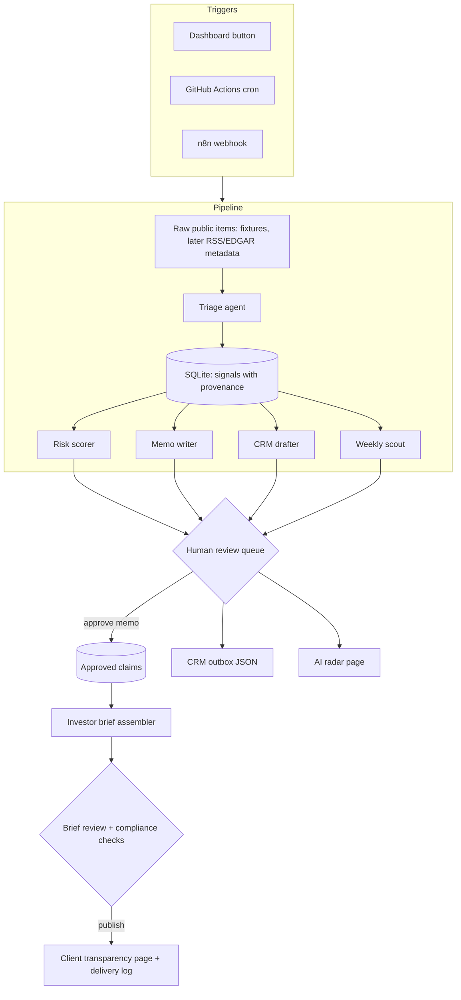

# MVP Plan

## Goal

Build a small but excellent demo of an AI operations layer for repeatable investment research: agent workflows, public-source ingestion, risk scoring, memo generation, CRM-ready output, weekly AI scouting, investor-facing transparency, and a human approval gate with full provenance.

The project proves practical implementation ability, not theoretical AI research. It is a demo and not investment advice.

## Product Sentence

An always-on junior analyst for a sector fund: it watches a public-company watchlist, turns public news into structured signals, updates risk scores with provenance, drafts IC memos and CRM follow-ups behind a human approval gate, ships a Monday AI radar brief — and turns the approved results into investor-facing transparency briefs in which every claim is source-linked and human-signed.

## Required Capabilities

- Agent workflow orchestration.
- Public source ingestion.
- Risk scoring with a versioned rubric.
- Investment memo generation with citations.
- CRM-ready output.
- Weekly AI scouting.
- Audit trail and source provenance.
- Human approval gate.
- Investor-facing transparency built from approved claims only.

## Architecture

## Data Model

SQLite via Drizzle. Provenance uses join tables, not array columns.

- `companies` — the watchlist.
- `raw_items` — public source metadata (title, snippet, URL, hash); never full article bodies.
- `signals` — triage output, each linked to its raw item, company, and the run that produced it.
- `runs`, `run_steps` — every pipeline execution with per-step model, prompt version, token counts, and cost.
- `claims` + `claim_signals` — approved statements extracted from reviewed artifacts, joined to their supporting signals.
- `client_segments` — fictional client groups with jurisdiction.
- `investor_briefs` — versioned, immutable-once-published client briefs assembled from approved claims.
- `delivery_log` — which brief went to which segment, when, by whom.

## Milestones

| Milestone | Scope | Verification |
| --- | --- | --- |
| M0 ✅ (2026-06-10) | Scaffold repo, dashboard shell, seeded watchlist, fixture-backed signal feed and run history | App boots offline and shows companies |
| M1 ✅ (2026-06-10) | SQLite/Drizzle/Zod, raw-item ingestion, deterministic DEMO_MODE triage, `POST /api/runs/morning-brief`, real run history | Run button creates run, step, and signal rows offline with no API keys |
| M2 ✅ (2026-06-10) | Risk scorer, score history, planted export-control event, provenance panel | Planted event moves a score; rationale cites it; every number traces to sources |
| M3 ✅ (2026-06-10) | Memo writer, review queue, CRM outbox, claim extraction on approval | Approval creates CRM-shaped JSON and approved-claim rows; rejection creates neither |
| M4 | Weekly AI radar; investor brief assembled from approved claims only, with compliance checks, client page, and delivery log | Unapproved claims provably cannot render on the client surface |
| M5 | README polish, demo reset command, GitHub Actions cron + n8n export, eval script, short recording | Fresh offline clone reaches the full demo in three commands |

## Approved Claims And Client Transparency

The same system serves two audiences through two surfaces:

- **Analyst cockpit** (internal): full visibility — raw signals, subscores, confidence, rejected drafts, prompt versions, models, token costs.
- **Client transparency brief** (investor-facing): a curated projection — only human-approved claims, balanced risk/opportunity language, plain-English theses, numbered public source links, and disclosure blocks.

Rules, enforced in code rather than in prompts:

- Only approved artifacts can become investor-facing. The brief assembler and the client page both join through `claims` with `status = approved`; an unapproved claim fails validation at generation time and again at publish time.
- No raw LLM output is ever rendered on a client-facing path. The client page reads only frozen, published snapshots.
- No performance predictions or advice language by default; deterministic checks block publishing, and any exception requires an explicit recorded review.
- Opportunity statements must be paired with risk statements.
- Every brief carries "for informational purposes only — not investment advice" labeling, an AI-assistance disclosure, and per-section labels distinguishing AI-assisted drafts from analyst-authored text, with approver and date.
- Published briefs are immutable; corrections create a superseding version. The delivery log records who received what, when.
- Disclosure copy lives as versioned files in the repo (placeholder text; a real deployment's compliance team owns it), and published briefs record the versions they shipped with.

## Data And Clean-Room Rules

- Companies on the watchlist are real public companies; everything about clients and the portfolio is fictional.
- Client segments are clearly labeled fictional. Portfolio exposure is synthetic display data; there are no real positions, allocations, or client records anywhere in the repo.
- Sources are public metadata only (titles, snippets, URLs, hashes) — never full copyrighted article bodies. In fixture mode, sources are synthetic and labeled as such.
- No proprietary code, private data, internal prompts, customer data, or secrets.
- `DEMO_MODE=true` is the default: the entire demo runs offline from fixtures with no API keys.

## Agents

### Source Collector

Loads public fixtures (later: RSS/EDGAR metadata). Stores metadata, snippets, hashes, and source URLs only.

### Triage Agent

Classifies each raw item: company, signal type, urgency, relevance, confidence, rationale, source link. Deterministic rule-based implementation in DEMO_MODE; LLM implementation behind the same schema in live mode.

### Risk Analyst

Produces five subscores — market, execution, regulatory/geopolitical, supply chain, financial — each with evidence and confidence. Plain code combines them with versioned rubric weights into one composite 0–100 score, so the number is explainable end to end.

### Memo Writer

Drafts thesis, key changes, bull/base/bear cases, catalysts, risks, IC questions, and what-would-change-our-mind, with inline citations to signal IDs.

### CRM Drafter

Creates reviewable follow-up tasks and email drafts for fictional client segments, shaped for CRM import.

### Weekly Scout

Produces a Monday brief across AI infrastructure, energy, semiconductors, and automation tooling.

### Brief Assembler

Assembles investor transparency briefs from approved claims only: exposure summary, theses, what changed, risks being monitored, sources, disclosures. Never sees or emits unapproved content on the client path.

## Time Boxing

Mandatory slice: M0 to M3.

Strongly recommended: M4 (the radar and the investor brief carry distinct value) and M5 (the README is the front door).

Cut first if time runs short, in order:

1. Live HubSpot push — keep the local CRM outbox.
2. Auto-generated slides — keep the radar page.
3. Evals UI — keep the CLI eval script.
4. Live n8n instance — keep the exported workflow JSON.
5. Print/PDF styling for the client brief — keep the page.
6. Second client segment and jurisdiction variants — keep one fictional segment.

Never cut: the approval gate, provenance, offline DEMO_MODE, the approved-claims boundary.

## Positioning

This is not a chatbot demo. It is a small operating workflow: scheduled inputs, structured outputs, source provenance, risk scoring, approval gates, CRM-shaped artifacts, investor-ready communication, and audit logs.

The value is consistency, speed, governance, analyst leverage — and client trust, because the investor-facing surface can only show what a human approved.
